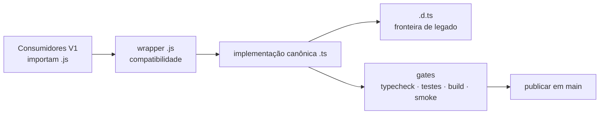
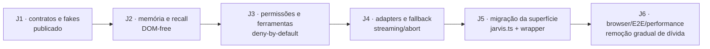
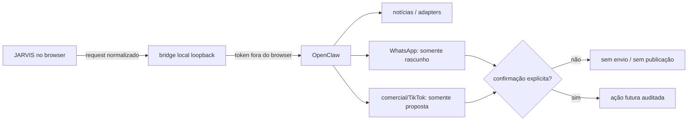

# Projeto-Baluarte — Migração TypeScript e plano JARVIS J1

## Slide 1 — Situação operacional

**Projeto-Baluarte**

Migração incremental JavaScript → TypeScript e plano JARVIS J1

**Marco publicado:** `a805ff8b` · `main` · 15 ago. 2026

**Resultado:** 884 testes verdes, 98 rotas verdes, J1 implementada e quatro páginas migradas sem quebrar a superfície V1.

> Construir a V2 por contratos, manter a V1 viva e reduzir o raio de regressão a cada onda.

## Slide 2 — Padrão de migração incremental

A regra operacional é **não fazer rewrite**. Cada módulo segue quatro fronteiras explícitas:

A implementação canônica recebe tipos estritos; o wrapper mantém os imports legados; o `.d.ts` descreve dados ou motores JS ainda não migrados; e o `tsconfig.json` cresce de forma incremental. A restrição permanece: **sem `any`, `@ts-ignore`, `@ts-nocheck` ou relaxamento de `strict`**.

## Slide 3 — Progresso verificável

A página migrou de 27 para **31 implementações TypeScript canônicas**, enquanto o inventário caiu de 87 para **83 páginas JS canônicas restantes**. A suíte alcançou **884/884** e o smoke confirmou **98/98 rotas**.

## Slide 4 — Matriz de gates no SHA publicado

| Gate | Resultado no `a805ff8b` | Leitura operacional |
| --- | --- | --- |
| `npm run tipos:ts` | Verde | Contratos TypeScript da onda sem erros |
| `npm test` | Verde: 884/884 | J1 e comportamento V1 preservados |
| `npm run build` | Verde | Vite compilou; somente aviso histórico de chunks grandes |
| Smoke/Vigia | Verde: 98/98 | Rotas, navegação, jornada e perda de rede preservadas |
| V2 Runtime | Verde | Runtime Rust validado remotamente |
| Arma 3 Data CI | Verde | Dados e parsers preservados |
| CodeQL | Verde | Análise de segurança passou |
| Core CI | Verde | Invariantes fora do check JSDoc passaram |
| CI / V2 Core / V2 Validation | Vermelho conhecido | Os mesmos 61 erros JSDoc em 12 arquivos V2; sem crescimento |

A falha vermelha é dívida arquitetural preexistente do portão `tipos:v2`, não uma regressão das páginas desta onda.

## Slide 5 — Marco 1: JARVIS, OpenClaw e Notícias

O Marco 1 criou uma camada de briefing compacta e cacheada para o JARVIS, normalização e deduplicação de notícias com proveniência, e o primeiro módulo nativo V2 de briefing em `v2/modules/briefing/`.

O bridge local do OpenClaw usa loopback, mantém o token fora do navegador e expõe apenas o endpoint OpenAI-compatible `POST /v1/chat/completions`. A camada é preparada para coexistir com o JARVIS leve, mas **não envia WhatsApp, não publica conteúdo e não realiza venda sem confirmação explícita do operador**.

**Documentos:** `docs/OPENCLAW.md`, `docs/v2/roadmap/MARCO_1_JARVIS_OPENCLAW_NOTICIAS.md` e `v2/modules/briefing/`.

## Slide 6 — JARVIS J1: contratos puros

| Contrato | Função |
| --- | --- |
| `SESSION_MODES` / `SessionMode` | Fechar os 12 modos suportados sem strings soltas |
| `JarvisMessage` | Mensagens de usuário, assistente e sistema |
| `JarvisSession` | Estado de sessão, modo, mensagens e metadados |
| `JarvisPublicConfig` | Configuração segura que pode chegar ao frontend |
| `ConversationRequest` | Entrada normalizada para adapters |
| `AdapterEvent` | Texto, progresso, tool call, erro, abort e timeout |
| `JarvisAdapter` | Superfície comum para local, Hermes, Claude, Ollama e OpenClaw |
| Guards e `hasSecretLikeKey` | Narrowing defensivo e bloqueio de segredo na superfície pública |

`jarvis-contracts-fakes.ts` fornece adapters determinísticos para todos os modos, permitindo testar fallback e falha sem rede real.

## Slide 7 — J1: cobertura focal

O teste `test/jarvis-contracts-j1.test.js` passou em **8/8 cenários**:

1. Todos os 12 modos são reconhecidos.
2. Modo inválido é rejeitado.
3. Mensagem e sessão válidas passam pelos guards.
4. Configuração pública e detecção de chave com aparência de segredo são validadas.
5. Fakes emitem texto, progresso e tool calls determinísticos.
6. Falha de permissão é representada como evento controlado.
7. Abort e timeout não travam a sessão.
8. A fábrica cria adapters para todos os modos sem dependência externa.

A cobertura é contratual e deliberadamente anterior à migração de `jarvis.js`.

## Slide 8 — Roteiro J1 → J6

A ordem evita misturar UI, memória, rede e permissões no mesmo commit. J2 deve extrair `buildMemoryCorpus`, briefing compacto, recall e memória durável para um serviço sem DOM. Só depois a página pesada será convertida.

## Slide 9 — Onda de páginas publicada

| Página | O que foi tipado | Risco |
| --- | --- | --- |
| `modpack.ts` | Filtros, tiers, estado persistido, abas Minecraft/Arma 3, presets e DLCs | Baixo/médio |
| `projetos.ts` | JSON de projetos, status, tags, rotas e cards | Baixo |
| `zomboid.ts` | Coleção, categorias, destaques e navegação para administração | Baixo |
| `zomboid-admin.ts` | Comandos, categorias, IDs, clipboard e busca debounced | Médio |
| `jogos.js` | **Adiado com segurança** | Médio/alto |

`Jogos` continua dependente de players engine, contas locais, XP, ranking, Code Quest e múltiplos runners. As declarações preparatórias foram isoladas; a migração comportamental fica para uma onda própria com testes de motor.

## Slide 10 — Inventário restante por risco

| Grupo | Restantes | Próxima abordagem |
| --- | ---: | --- |
| Páginas utilitárias e conteúdo | 40 | Cripto, calculadoras e conteúdo pequeno |
| Ferramentas interativas | 12 | Fechar estado, DOM, runners e lifecycle |
| IA, Nexus e memória | 10 | Contratos JARVIS/Nexus antes da UI |
| Mídia, rádio e DSP | 8 | APIs de mídia, canvas e recursos externos |
| Arma 3, 3D e visualização | 7 | Dados grandes, WebGL e limpeza |
| Hubs e catálogos | 3 | Jogos, Aprendizado e Mural |
| Conteúdo militar | 3 | Dados estáticos e preservação de rota |
| **Total** | **83** | Inventário operacional atualizado |

As páginas `jarvis.js`, `editor.js`, Wiki Arma 3, Arma 3 Tutorial, Vanguard, Visão, mídia e 3D permanecem reservadas para ondas próprias de alto risco.

## Slide 11 — OpenClaw com fronteira segura

O princípio é **read-first e confirm-before-send**. O bridge não recebe credenciais do frontend, não abre acesso arbitrário à rede e não executa ação comercial silenciosa. A otimização do JARVIS prioriza briefing compacto, adapters uniformes, cache e execução local leve.

## Slide 12 — Caminho até “V2 concluída”

A V2 só deve receber o “bateu o martelo” quando o conjunto de módulos passar pelo ciclo completo: contrato estrito, testes comportamentais, build, smoke de todas as rotas, caminho crítico, integração V2, Runtime/E2E, segurança e revisão de permissões.

**Próximas entregas:** J2 de memória/recall; migração controlada de Jogos; redução dos 61 erros JSDoc por contratos compartilhados de Runtime; novo layout Command Shell Modular; PokeDesk completo; Wiki Arma 3 com ícones já presentes em `public/arma3/`; protótipo de app quando a base estiver minimamente estável.

Depois do marco final, todos os módulos entram em **testes mensais**, com relatório de regressões, disponibilidade e integridade de dados. O mapa de execução está em `docs/ROADMAP_COMPLETO.md`, `docs/v2/TYPESCRIPT_REMAINING.md` e `docs/v2/roadmap/JARVIS_WAVE_1_CONTRACTS.md`.
